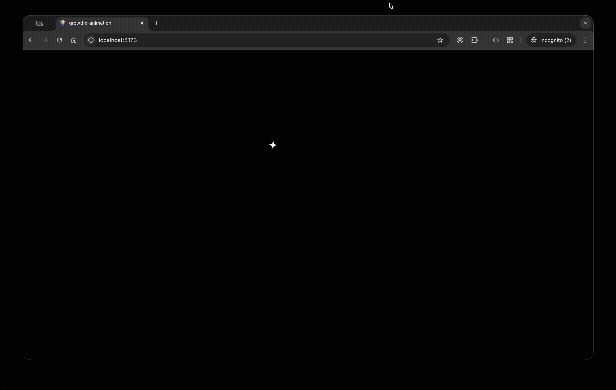

# Assignment: SDE Frontend – GrowthX Club

<div align="center">
  
  <p>
    <em>animation from GrowthX Club using HTML, CSS, and JavaScript (React + Vite)</em>
  </p>
</div>

## Objective

The goal of this assignment is to replicate a specific animation from GrowthX Club using **HTML, CSS, and JavaScript (React + Vite)**. The focus is on performance, smooth animation, and frontend development skills.

## Tech Stack

- ⚛️ React (with Vite)
- 🟦 TypeScript
- 🎨 CSS

## Project Structure

```
src/
├── assets/             # Static images or icons
├── components/         # React components
├── App.tsx             # Root component
├── main.tsx            # Entry point
├── index.css           # Global styles
└── ...
```

## Getting Started

### Prerequisites

- Node.js ≥ 18.x
- npm or yarn

### Installation

```bash
# Clone the repository
git clone https://github.com/your-username/your-repo-name.git

# Navigate into the project
cd your-repo-name

# Install dependencies
npm install
# or
yarn
```

### Run the Development Server

```bash
npm run dev
# or
yarn dev
```

Visit `http://localhost:5173` to see the app.

## Build & Preview

### Build for Production

```bash
npm run build
# or
yarn build
```

### Preview the Production Build

```bash
npm run preview
# or
yarn preview
```

## Notes

- ❌ **No dynamic imports**: All critical assets and animation code are statically loaded to ensure instant animation rendering on page load.
- ⚡ **Optimized for performance**: Animation starts immediately when the page loads.
- 🔁 **CSS re-triggerable animation**: The animation can be re-triggered through CSS classes (e.g., by toggling classes or re-rendering).
- 🎨 **No Lottie used**: Animation is built purely with web technologies as per the assignment requirements.

## AI Usage

I used AI tools during development to assist with:

- Debugging animation timing issues.
- Writing performant CSS for smoother transitions.

## License

This project is submitted as part of the SDE Frontend assignment for GrowthX Club. Reuse or redistribution is not permitted without permission.

---
